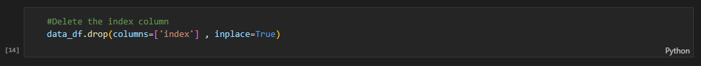
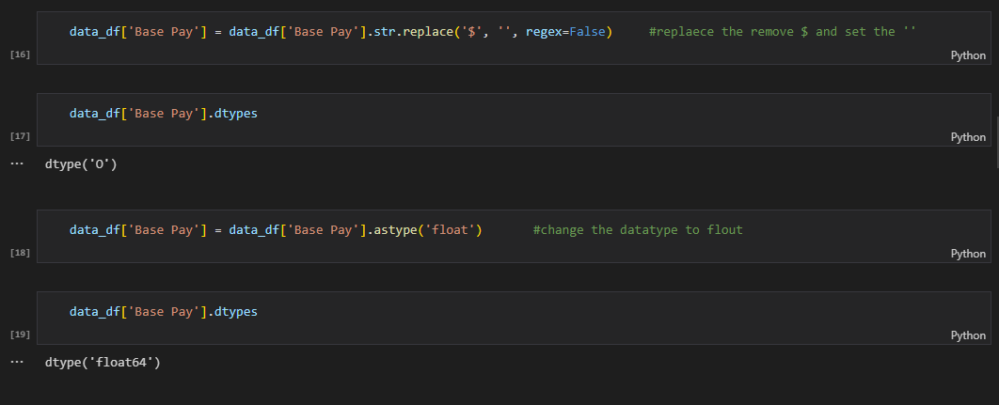

# 2 - Higher_Education_Salaries

--------------------

--------------------

## Introduction

The aim of this project is to gain insights into Education wage distributions in the USA, by implementing my analysis skills using (Python).

## Problem Statement

In the United States, the cost of university is extremely high. A large part of the money universities collect every year is spent on salaries.
But who gets the most money?

### TOOLS
- PYTHON
- MICROSOFT EXCEL

## Data Sourcing

The data was in the [Kaggle]( https://www.kaggle.com/datasets/thedevastator/uncovering-wage-disparities-in-pennsylvania-s-hi) website.
The dataset contains 12632 rows and 5 columns.

### About the data : 
-	Name: The name of the employee.
-	Base Pay: The base salary of the employee.
-	University or Office: The university or office the employee works for.
-	Position: The position of the employee.

## Cleaning & Analysis(EDA)

### The data was cleaned, with no missing values but let's change a few things.
1- Deleting the 'index' column because we don't need it.

-------------------------

2- Changing the data type of 'Base Pay' to flout, and delete the symbol '$

-------------------------

### Here is the full [code]( https://github.com/Abdulqader-Asiri/Portfolio_Projects/blob/main/project_2/Portfolio_Project2.ipynb), we could discover the following things in the dataset:
    1- The person who gets the most money is: Cavanaugh, John C, AND his base Pay is: 327500.0, AND he is a Chancellor
    2 - The Position that gets the most money is: Professors AND their base Pay is: 110,591,809.0, AND they are: 1077 Professors.
    3 - The University or Office that gets the most people is: West Chester and the one that gets the less people is: the Office of the Chancellor
    4 - The university, that gets the most money is: Indiana / and they spend: 90,714,032.0 in the salary
    5 - The person that paid the least is: Webster, Kim and his payment is: 1245.0, and the Position that gets less base pay is: Instructor
    6 – and more …

# Thank you
